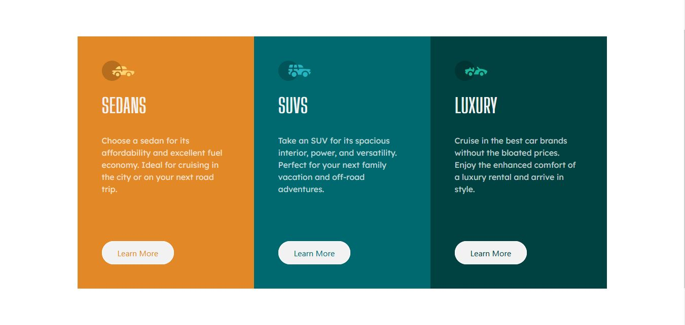

# Frontend Mentor - 3-column preview card component solution

This is a solution to the [3-column preview card component challenge on Frontend Mentor](https://www.frontendmentor.io/challenges/3column-preview-card-component-pH92eAR2-). Frontend Mentor challenges help you improve your coding skills by building realistic projects. 

## Table of contents

- [Overview](#overview)
  - [The challenge](#the-challenge)
  - [Screenshot](#screenshot)
  - [Links](#links)
- [My process](#my-process)
  - [Built with](#built-with)
  - [What I learned](#what-i-learned)
  - [Continued development](#continued-development)
  - [Useful resources](#useful-resources)
- [Author](#author)

**Note: Delete this note and update the table of contents based on what sections you keep.**

## Overview

### The challenge

Users should be able to:

- View the optimal layout depending on their device's screen size
- See hover states for interactive elements

### Screenshot

### Links

- Solution URL: [Solution](https://github.com/raked/3-column-preview-card-component)
- Live Site URL: [Live Site](https://tender-davinci-83718b.netlify.app/)

## My process

### Built with

- Semantic HTML5 markup
- CSS custom properties
- Flexbox
- [Bootstrap 5](https://getbootstrap.com/) - JS library

### What I learned

I got more familiar with CSS Flexbox and using CSS in tandem with Bootstrap 5.

### Continued development

I think I still need to work on some of my more advanced skills such as JavaScript & related frameworks.

### Useful resources

- [Bootstrap 5 Documentation](https://getbootstrap.com/docs/5.0/getting-started/introduction/) - Helped me along my way of using CSS & Bootstrap 5 together.

## Author

- Website - [Daniel Fell Jr](https://raked.github.io)
- Frontend Mentor - [@raked](https://www.frontendmentor.io/profile/raked)
